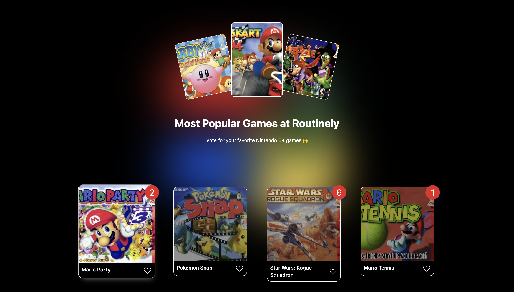

# Nintendo64 Games Voting Application



This single-page voting application allows the Routinely team to vote for their favourite Nintendo 64 games!
This microservice was made using Next.js framework with TailwindCss, used for customizing user-interfaces.

## How does it work?

The data on this application is directly linked to a JSON file. Any changes to this application content can be made in the JSON file. This allows the team to customize and add new games to choose from. The changes will then be reflected on to the app.

## Install Node.js:

First of all, download the latest version of [Node.js](https://nodejs.org/en/download/).

## How to start building?

Open your terminal and execute [`npx create-next-app -e with-taildwindcss my-project-name`](https://tailwindcss.com/docs/guides/nextjs) with [npm](https://docs.npmjs.com/cli/init) or [Yarn](https://yarnpkg.com/lang/en/docs/cli/create/):

```bash
npx create-next-app --example with-tailwindcss with-tailwindcss my-project-name
# or
yarn create-next-app --example with-tailwindcss with-tailwindcss my-project-name
```

Execute `cd my-project-name` to enter the file, then open this file in your code editor with `code .`

```bash
cd my-project-name
# then
code .
```

## Extensions 🔌

Search for [`Tailwind Css Intellisense`](https://marketplace.visualstudio.com/items?itemName=bradlc.vscode-tailwindcss) and install in your editor. This will allow for very smooth interfaces.

\*\* Remember:
In order to have this extension work, you must have [`Tailwind Css`](https://tailwindcss.com/docs/installation) already installed.

## Results

In terminal, type:

```bash
npm run dev
```

Then open http://localhost:3000 with your browser to see the result.
Once the project is opened in the browser, the team will be able to cast their votes, count total votes that appear in the red badge, and pick their most favorite games!

## Acknowledgements

Thank you Routinely team for this opportunity, and for this fun assignment 🙌
I hope to be playing with you at Mario Kart (my favorite) very soon!
